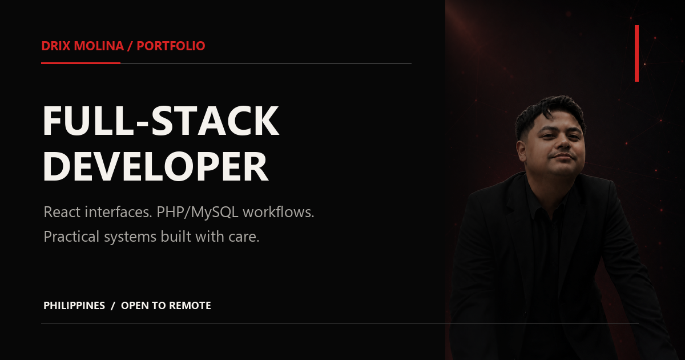

# Drix Molina - Full-Stack Developer Portfolio

Recruiter-focused portfolio for Drix Molina, a BS Information Technology graduate and Web Developer building practical web and mobile systems.

**Production:** [webfolio-dm.vercel.app](https://webfolio-dm.vercel.app/)
**Planned custom domain:** `drixmolina.com`



## What this portfolio demonstrates

- Responsive React and TypeScript interface development
- PHP/MySQL-backed academic workflow design
- Accessible navigation, forms, dialogs, and reduced-motion behavior
- Project testing, documentation, and evidence-based case studies
- Vercel deployment with a serverless Resend contact endpoint

## Featured case studies

### Highly Succeed Employee & Inventory Management System

A responsive React system prototype spanning employee records, attendance, leave, onboarding, inventory, reporting, and role-aware administration.

- [Read the case study](https://webfolio-dm.vercel.app/work/highly-succeed)
- [Review the public source](https://github.com/drixmolina/Highlysucceed)

### FacilitEASE

A web and mobile property management capstone connecting reservations, job orders, inventory, maintenance, personnel dispatch, notifications, and calendars.

- [Read the case study](https://webfolio-dm.vercel.app/work/facilitease)
- Verified scope: seven modules, four role groups, alpha and beta testing, and two project awards

### DEADKIDS E-Commerce Website

A React and Express streetwear e-commerce prototype combining an editorial storefront with product discovery, customer workflows, reviews, and protected content administration.

- [Read the case study](https://webfolio-dm.vercel.app/work/deadkids)
- [Review the public source](https://github.com/drixmolina/deadkids)
- Interface evidence is divided into nine exact sections from the supplied full-page website capture

## Technology

- React 19 and TypeScript
- React Router 8
- Vite 6 and Tailwind CSS 4
- Lucide React
- Vercel Functions and Resend
- Vercel Web Analytics

## Accessibility

The portfolio includes:

- Semantic landmarks and one clear page heading per route
- Skip navigation
- Keyboard-accessible mobile navigation and dialogs
- Focus trapping, Escape-key handling, and focus restoration
- Visible focus states and accessible form errors
- Descriptive alternative text and explicit image dimensions
- Reduced-motion support
- Responsive layouts down to 360px

## Performance and privacy

- AVIF and WebP variants for the hero portrait and primary project media
- Lazy-loaded below-the-fold screenshots
- Sanitized company screenshots with demonstration identities and credentials obscured
- A text-preserving optimized research PDF
- A 1200x630 PNG social preview
- Sitemap, robots directives, canonical metadata, and structured data
- Anonymous, cookie-free Vercel page analytics

## Local development

Requires Node.js 24.

```bash
npm install
npm run dev
```

Create `.env.local` for local contact-form testing:

```env
RESEND_API_KEY=
CONTACT_EMAIL=drixmolina31@gmail.com
```

The public site remains usable without those variables; the contact endpoint reports an honest service-unavailable response and presents the direct email address.

## Verification

```bash
npm run build
```

Verify:

- `/`
- `/work/highly-succeed`
- `/work/facilitease`
- `/work/deadkids`
- `/api/contact`
- `/resume/Drix_Molina_Resume.pdf`
- `/sitemap.xml`
- `/robots.txt`

## Deployment

The project is linked to Vercel as `webpolio`. Git pushes create deployments through the connected Vercel project. The `vercel.json` rewrite keeps direct case-study URLs working without intercepting `/api/contact`.

Before activating `drixmolina.com`, purchase and attach the domain, set the preferred `www` redirect, then replace the current production URL in metadata, structured data, the sitemap, the résumé, and public profiles.
